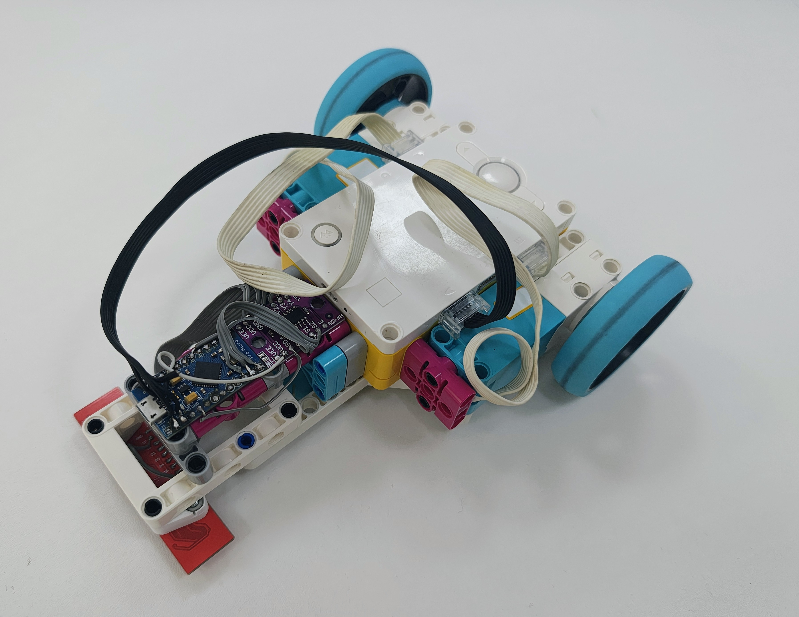
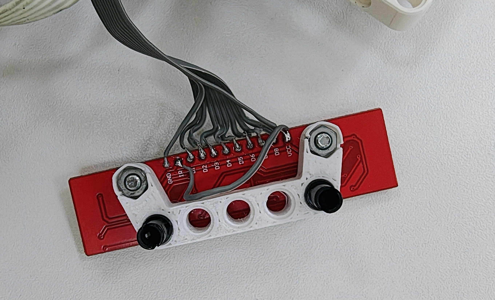

# HY-S301 Line Sensor для Pybricks (SPIKE Prime)

Этот проект позволяет использовать **8-канальный линейный датчик HY-S301 / HW-529** в качестве полноценного LPF2‑сенсора для LEGO SPIKE Prime с прошивкой **Pybricks**.

Arduino Pro Micro эмулирует LPF2‑устройство и передаёт данные по UART. Датчик работает как `PUPDevice`.

---

# Hardware

## Компоненты
- Датчик линии 8 канальный HY-S301 
- Модуль HW-529 аналогового 8-и канального мультиплексора
- Arduino Pro Micro
- 2× винта M3 + гайки
- распечатанное крепление [HY-S301_Lego_mount.stl](HY-S301_Lego_mount.stl)
- Провод LPF2

## Изображения





## Робот
[line_follower_base.io](line_follower_base.io) — модель SPIKE-робота для демонстрациии движения по линии.

---

## Проводка

### 🎛 Arduino Pro Micro → HY‑S301

```
HY‑S301       Pro Micro
------------------------
S0        →   D7
S1        →   D8
S2        →   D9
OUT       →   A1
VCC       →   5V
GND       →   GND
```

### 🔌 Arduino Pro Micro → SPIKE Prime (LPF2 UART)

```
SPIKE Prime       Pro Micro
----------------------------
TX           →    RX1 (D0)
RX           →    TX0 (D1)
5V           →    VCC
GND          →    GND
```

---

# Software

## Зависимость (Arduino)
Используется библиотека:

**LumpDeviceBuilder**  
https://github.com/devilhyt/lump-device-builder-library

---

## Первая версия (совместимая с MBC‑датчиком)

Файлы лежат в папке mbc_compatible.

Эмуляция датчика:

**MBC Line Following Sensor**  
https://www.axione.shop/product-page/mbc-line-following-sensor

Выдаёт те же данные, что и оригинал.

---

## Вторая версия (простая LINE8)

Прошивка Arduino в папке *code*.

Передаёт ровно **8 байт (0–255)** — значения каналов слева направо.

Пример чтения в pybricks [sensor_read.py](sensor_read.py)

Также есть простой пример движения по линии. [LineFollower_simple.py](LineFollower_simple.py)

---
